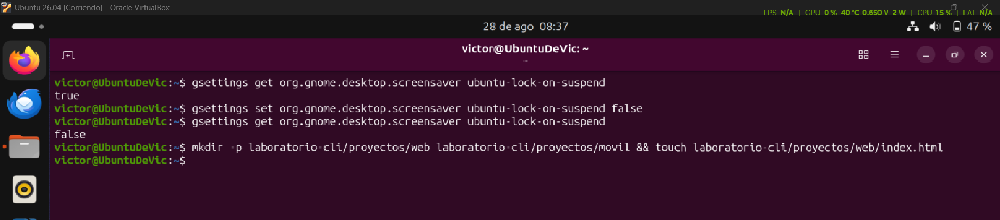
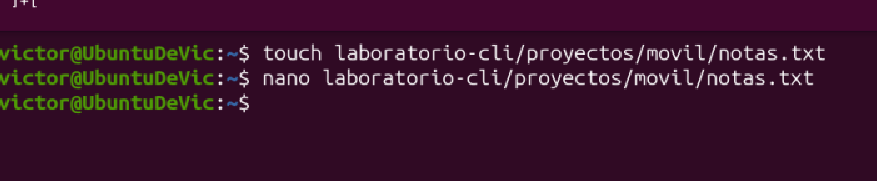
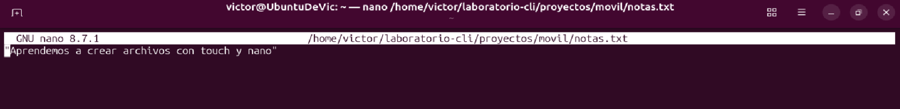
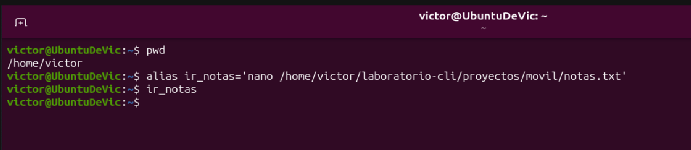
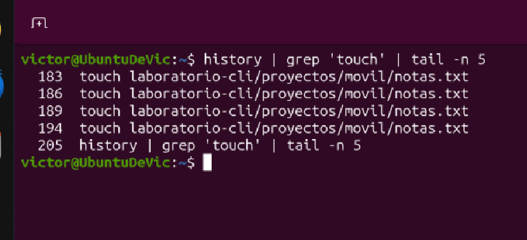
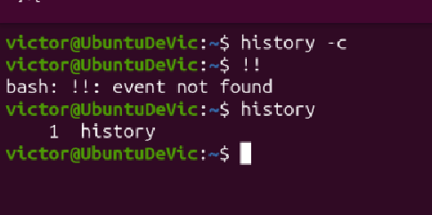
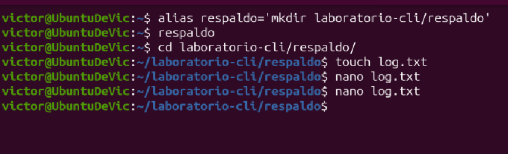
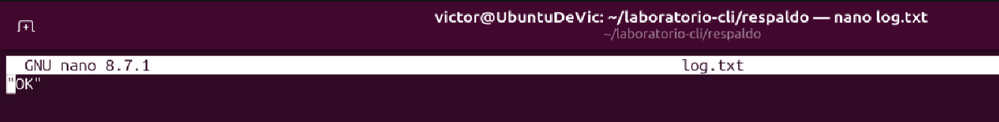
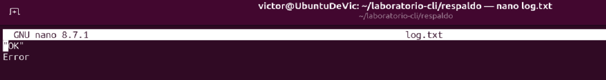
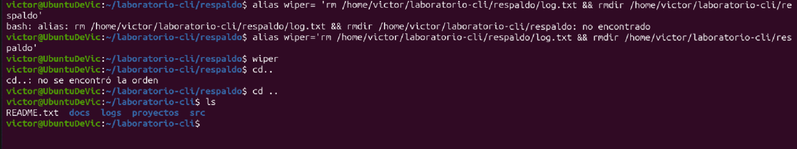

# Laboratorio CLI

Ejercicios de práctica con comandos de terminal en Ubuntu: creación de carpetas y archivos, uso de `nano`, alias, e historial de comandos.

---

## Ejercicio 1 — Crear estructura de carpetas dentro de `laboratorio-cli`

**Objetivo:** dentro de `laboratorio-cli`, crear la carpeta `proyectos`, y dentro de ella las carpetas `web` y `movil`. Dentro de `web`, crear el archivo `index.html` con `touch`.

**Comando utilizado:**

```bash
mkdir -p laboratorio-cli/proyectos/web laboratorio-cli/proyectos/movil && touch laboratorio-cli/proyectos/web/index.html
```



---

## Ejercicio 2 — Crear `notas.txt` dentro de `movil`

**Objetivo:** crear el archivo `notas.txt` dentro de `proyectos/movil` con `touch`, y luego escribir dentro de él el texto `"Aprendemos a crear archivos con touch y nano"` usando `nano`.

**Comandos utilizados:**

```bash
touch laboratorio-cli/proyectos/movil/notas.txt
nano laboratorio-cli/proyectos/movil/notas.txt
```



**Resultado — contenido del archivo `notas.txt`:**



---

## Ejercicio 3 — Alias `ir_notas`

**Objetivo:** crear un alias llamado `ir_notas` que abra directamente el archivo `notas.txt` desde cualquier carpeta.

**Comando utilizado:**

```bash
alias ir_notas='nano /home/victor/laboratorio-cli/proyectos/movil/notas.txt'
ir_notas
```



**Verificación — el alias abre correctamente el archivo con su contenido:**


---

## Ejercicio 4 — Historial de comandos

**Objetivo:** revisar el historial de los últimos 5 comandos, filtrar el contenido para mostrar solo la ejecución de `touch`, luego eliminar el historial de comandos, ejecutar `!!` y mostrar el historial actual.

**Comandos utilizados:**

```bash
history | grep 'touch' | tail -n 5
history -c
```



**Al intentar repetir el último comando con `!!`:**

```bash
!!
```

`!!` expande al último comando ejecutado, pero como el historial ya se había limpiado con `history -c`, no hay ningún evento previo que expandir, por lo que devuelve el error `bash: !!: event not found`.

```bash
history
```



---

## Ejercicio 5 — Alias `respaldo`, `error` y `wiper`

**Objetivo:**
- Crear un alias llamado `respaldo` que genere una carpeta con el mismo nombre (`respaldo`) y ejecutarlo.
- Entrar a la carpeta `respaldo` y crear el archivo `log.txt` con la palabra `"OK"` dentro.
- Crear un alias llamado `error` que agregue la palabra `"Error"` dentro de `log.txt`.
- Crear un alias llamado `wiper` que elimine el archivo `log.txt` y la carpeta `respaldo`.

**Comandos utilizados — creación del alias `respaldo` y del archivo `log.txt`:**

```bash
alias respaldo='mkdir laboratorio-cli/respaldo'
respaldo
cd laboratorio-cli/respaldo/
touch log.txt
nano log.txt
```



**Resultado — `log.txt` con la palabra "OK":**



**Resultado — después de ejecutar el alias `error`, se agrega la palabra "Error":**

```bash
alias error='echo "Error" >> log.txt'
error
```



**Comando utilizado — alias `wiper` que borra `log.txt` y la carpeta `respaldo`:**

```bash
alias wiper='rm /home/victor/laboratorio-cli/respaldo/log.txt && rmdir /home/victor/laboratorio-cli/respaldo'
wiper
cd ..
ls
```



La carpeta `respaldo` ya no aparece en el listado de `laboratorio-cli`, confirmando que `wiper` eliminó correctamente el archivo y la carpeta.
